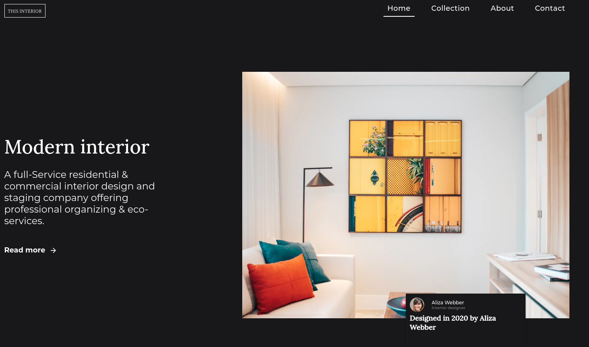
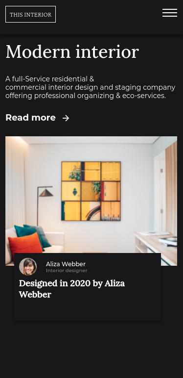

<!-- Please update value in the {}  -->

<h1 align="center">Interior Consultant</h1>

   Solution for a challenge from  <a href="http://devchallenges.io" target="_blank">Devchallenges.io</a>.

  <h3>
    <a href="https://peaceful-booth-2c8122.netlify.app/">
      Demo
    </a>
     | 
    <a href="https://github.com/mourodev/interior-consultant">
      Solution
    </a>
     | 
    <a href="https://devchallenges.io/challenges/wBunSb7FPrIepJZAg0sY">
      Challenge
    </a>
  </h3>

<!-- TABLE OF CONTENTS -->

## Table of Contents

- [Table of Contents](#table-of-contents)
- [Overview](#overview)
- [What was your experience?](#what-was-your-experience)
- [What have you learned / improved?](#what-have-you-learned--improved)
  - [Built With](#built-with)
- [Features](#features)
- [Contact](#contact)

<!-- OVERVIEW -->

## Overview

## What was your experience?
- My experience was the best possible, as I am a beginner in web development and I was able to further explore the knowledge gained so far with HTML and CSS

## What have you learned / improved?
- I learned a little more about the semantic structure of HTML and placements with CSS.

### Built With

<!-- This section should list any major frameworks that you built your project using. Here are a few examples.-->

- [HTML](https://#/)
- [CSS](https://#/)

## Features

<!-- List the features of your application or follow the template. Don't share the figma file here :) -->

This site was created as a submission to a [DevChallenges](https://devchallenges.io/challenges) challenge. The [challenge](https://devchallenges.io/challenges/wBunSb7FPrIepJZAg0sY) was to build an application to complete the given user stories.

## Contact

- GitHub [@mourodev](https://github.com/mourodev)
- Twitter [@moouro](https://twitter.com/moouro)
